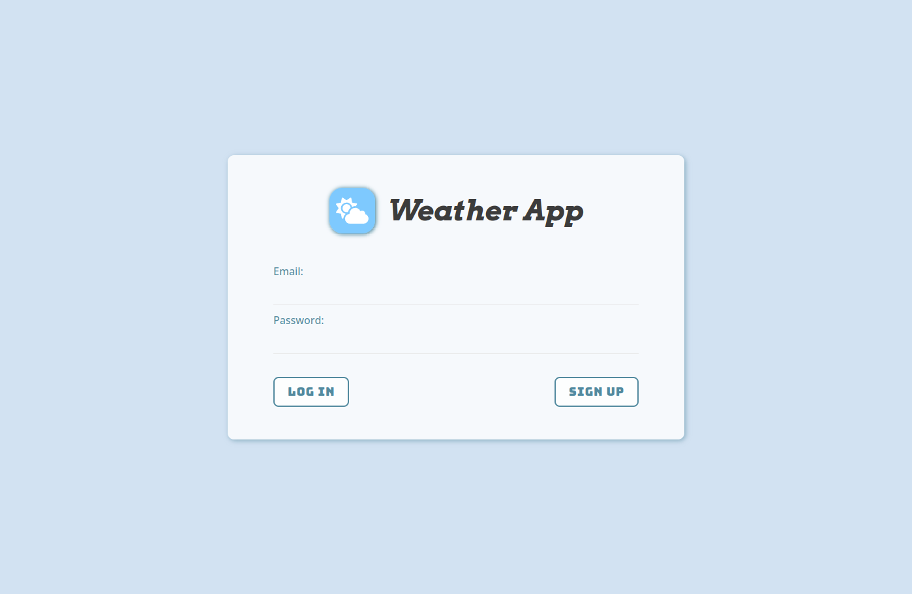
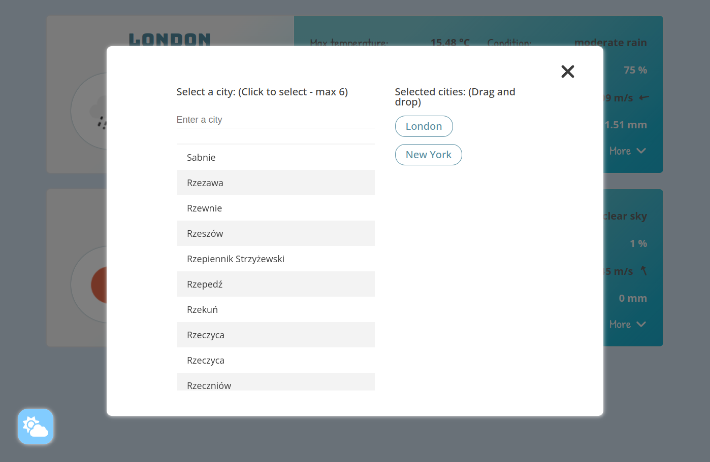

# Weather App

Aplikacja pogodowa umożliwiająca obserwację podstawowych danych meteorologicznych dla wybranych miast. Użytkownik po zalogowaniu ma możliwość obserwacji m.in. temperatury, wilgotności, warunków wietrznych czy danych dotyczących deszczu. Dodatkowo, aplikacja umożliwia wyświetlenie prognozy na najbliższe dni. Użytkownik ma możliwość obserwacji maksymalnie 6 miast.

Weather application that allows you to observe basic meteorological data for selected cities. The user after logging in has the opportunity to observe the temperature, humidity, wind conditions or data about rain. Additionally, the app allows you to view the forecast for the coming days. User can observe maximum 6 cities.

## Demo

https://piotrhol.github.io/Weather/

## Technologies

React, Sass, Redux, React Router, Firebase, React Hook Form, OpenWeather API, React Window, react smooth dnd, classnames, dotenv

## Example screenshots

- Login Page

- Main view

- Main view with forecast

- Setting cities popup

