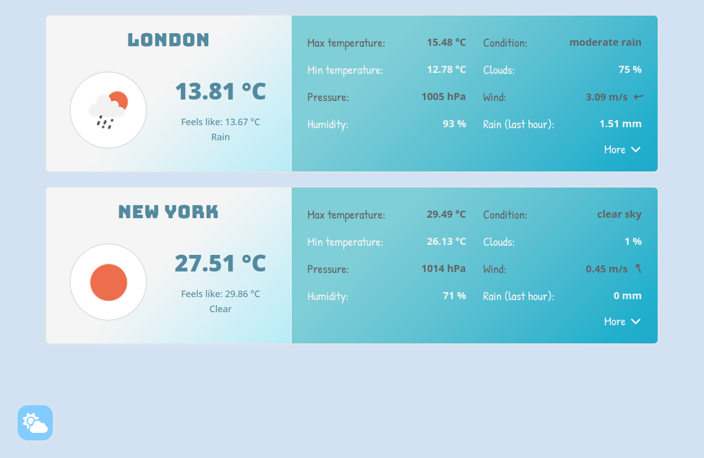
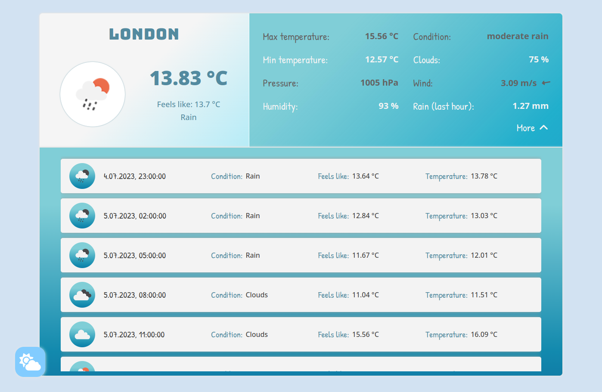

# Weather App

Aplikacja pogodowa umożliwiająca obserwację podstawowych danych meteorologicznych dla wybranych miast. Użytkownik po zalogowaniu ma możliwość obserwacji m.in. temperatury, wilgotności, warunków wietrznych czy danych dotyczących deszczu. Dodatkowo, dla 5 następnych dni, dane temperatury i wilgotności umieszczone zostały na wykresach. Użytkownik ma możliwość obserwacji maksymalnie 6 miast.

Weather application that allows you to observe basic meteorological data for selected cities. The user after logging in has the opportunity to observe the temperature, humidity, wind conditions or data about rain. Additionally, for the next 5 days temperature and humidity data are placed on the charts. User can observe maximum 6 cities.

## Demo

https://piotrhol.github.io/Weather/

## Technologies

React, Sass, Redux, React Router, Firebase, React Hook Form, OpenWeather API, React Window, Recharts, classnames, dotenv

## Example screenshots

- Login Page

- Main view

- Main view with charts

- Setting cities page

